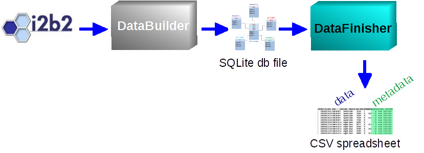

#### Instructions

DataFinisher is part of a pipeline for getting data from an i2b2 query into a 
standardized tabular form compatible with Excel, SAS, R, and almost any other 
analysis software. The overall pipeline looks like this:

The KUMC-developed DataBuilder app extracts the visits selected by an i2b2 query 
along with user-specified data elements as a SQLite database file that is like a 
miniature version of the i2b2 database containing only the requested patients, 
visits, and observations. The job of Data*Finisher* is to 'finish the job' by 
taking this file and turning it into a plain-text (comma-delimited, 
tab-delimited, etc.) spreadsheet where each visit is a row sorted by patient 
number and date, and each i2b2 data element as a column. This is an 
ordinary spreadsheet with additional metadata embedded in it that DataFinisher 
uses to let the user change how the data is represented and with what 
granularity. So you could break out one i2b2 main variable into multiple 
output columns, transform them into more convenient formats, and filter which 
observations show up in a given column. You can even create your own custom 
rules for transforming data.

To use DataFinisher, you can upload either a SQLite db file created by 
DataBuilder or a spreadsheet previously created by DataFinisher. *You can keep 
coming back and amending how your data is represented at your convenience 
without having to submit a new i2b2 data-extraction request.*

**If you do not have a file to try this on, here is some simulated data 
in <a href='demodata.csv' target='_blank'>.csv format</a> and in 
<a href='demodata.db' target='_blank'>SQLite .db format</a>** (adapted from 
http://i2b2.org/). These are demo datasets that contain no PHI, for you to 
download and then upload back up here so you can try out this app. 

A site can also be configured to automatically deposit files into a trusted 
directory that is not accessible directly from the web but is accessible to 
DataFinisher. Under such a configuration, the users are sent unique, 
non-guessable links to their individual files. When a unique link is provided 
the user does not have to upload anything. Instead DataFinisher takes them 
directly to their file. 
Here is **<a href='?dfile=file128548a46494.csv'>an example</a>**.
